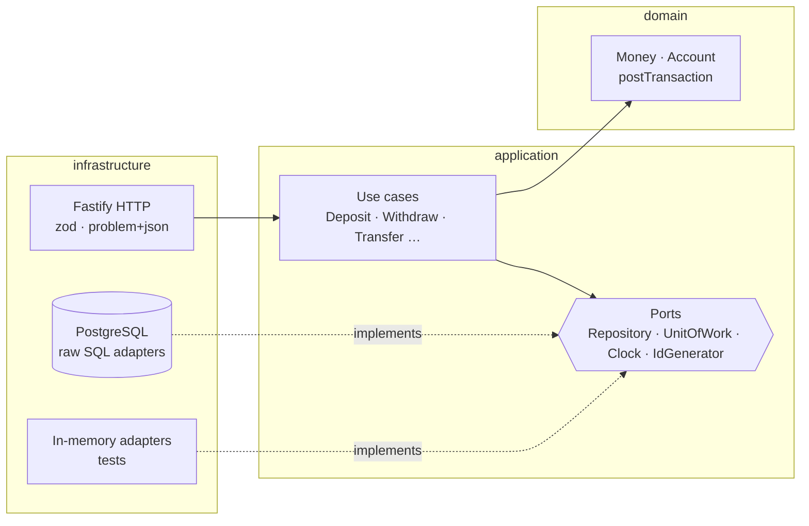

# Keel

> A double-entry ledger service that makes losing money a type error.

[](https://github.com/viniciuslks7/Keel/actions/workflows/ci.yml)


[](https://viniciuslks7.github.io/Keel/)

**▶ [Try the live demo](https://viniciuslks7.github.io/Keel/)** — open accounts, deposit,
withdraw, transfer and page through statements right in the browser. There is no backend:
the **same** domain and use-case code that runs on the server is compiled to run client-side
against the in-memory adapter.

Keel is the bookkeeping core of a digital wallet: accounts, deposits,
withdrawals and transfers, built the way payment companies actually build
them — as an **append-only double-entry ledger**, not a mutable balance
column. The name comes from the part of a ship that keeps it balanced.

**Why this exists:** most wallet demos increment a `balance` field and call
it a day. That design cannot answer "why is this balance wrong?" and quietly
loses money under concurrency. Keel demonstrates the production-grade
alternative, end to end, in ~1.5k lines of strict TypeScript.

---

## Guarantees

| Invariant | How it's enforced |
|---|---|
| Money is never created or destroyed | Every transaction posts balanced DEBIT/CREDIT entries through a single domain function; unbalanced postings cannot be constructed |
| No overdrafts, even under concurrency | `SELECT … FOR UPDATE` row locks acquired **before** the balance read; verified by a test firing 5 parallel withdrawals |
| No deadlocks between transfers | Locks always acquired in ascending account-id order — deterministic ordering makes deadlock impossible by construction |
| Client retries never double-post | `Idempotency-Key` header backed by a unique constraint; identical replays return the original transaction, divergent reuse gets `409` |
| No floating-point money | `Money` value object holds integer minor units only; fractional or unsafe amounts are rejected at construction |
| Full audit trail | Entries are append-only — no UPDATE/DELETE path exists; every balance always reconciles to `SUM()` over entries (the materialized total is a cache rebuilt from them) |

## Architecture

Hexagonal (ports & adapters). Dependencies point strictly inward; the domain
imports nothing.



```
src/
├── domain/            # Money, Account, postTransaction — zero outward imports
├── application/
│   ├── ports/         # Interfaces the domain core needs from the world
│   └── use-cases/     # One class per operation, orchestration only
├── infrastructure/
│   ├── http/          # Fastify adapter: routes, zod schemas, RFC 9457 errors
│   └── persistence/
│       ├── postgres/  # Hand-written SQL, FOR UPDATE locking, keyset pagination
│       └── in-memory/ # Transactional twin used by the test suite
└── main.ts            # Composition root — the only file that knows every layer
```

The HTTP adapter depends only on use cases, so the **entire API test suite
runs in-memory in ~1 second** — same transactional semantics (serialization
+ rollback), zero containers.

Key design decisions are documented as ADRs in [`docs/adr/`](docs/adr/):
double-entry over balance columns, hexagonal layering, integer minor units,
the idempotency/locking strategy, zero-balance account closing, the
transactional outbox for domain events, OpenTelemetry tracing around the
unit of work, materialized running balances for hot accounts, and
cross-currency transfers that balance per currency.

## How the ledger works

Every operation is a balanced set of entries. Deposits and withdrawals post
against a per-currency **SYSTEM treasury account**, so even the boundary with
the outside world balances:

```
DEPOSIT  R$100 → alice     │ DEBIT  treasury:BRL  10000
                           │ CREDIT alice         10000
TRANSFER R$40 alice → bob  │ DEBIT  alice          4000
                           │ CREDIT bob            4000
WITHDRAW R$10 ← bob        │ DEBIT  bob            1000
                           │ CREDIT treasury:BRL   1000
```

At any instant: `Σ customer balances = −(treasury balance)`. The trial
balance is a test, not a hope.

## API

Full spec: [`docs/openapi.yaml`](docs/openapi.yaml). Errors follow
[RFC 9457](https://www.rfc-editor.org/rfc/rfc9457) `application/problem+json`.

| Method | Path | Description |
|---|---|---|
| `POST` | `/accounts` | Open an account |
| `GET` | `/accounts/:id` | Fetch an account |
| `POST` | `/accounts/:id/close` | Close an account (requires zero balance) |
| `GET` | `/accounts/:id/balance` | Balance derived from entries |
| `GET` | `/accounts/:id/statement` | Keyset-paginated statement |
| `POST` | `/accounts/:id/deposits` | Deposit (idempotent) |
| `POST` | `/accounts/:id/withdrawals` | Withdraw (idempotent, no overdraft) |
| `POST` | `/transfers` | Atomic same-currency transfer (idempotent) |
| `POST` | `/exchanges` | Cross-currency transfer at an FX rate (idempotent) |
| `GET` | `/health` | Liveness probe |

```bash
# open an account
curl -s localhost:3000/accounts \
  -H 'content-type: application/json' \
  -d '{"ownerName":"Ada Lovelace","currency":"BRL"}'

# deposit R$ 150,00 — safe to retry with the same key
curl -s localhost:3000/accounts/$ACCOUNT/deposits \
  -H 'content-type: application/json' \
  -H 'idempotency-key: dep-2026-001' \
  -d '{"amountCents":15000}'

# transfer
curl -s localhost:3000/transfers \
  -H 'content-type: application/json' \
  -d '{"fromAccountId":"'$ALICE'","toAccountId":"'$BOB'","amountCents":4000}'
```

## Running

**Docker (API + PostgreSQL):**

```bash
docker compose up --build
npm run migrate   # once, with DATABASE_URL pointing at the container
```

**Local development:**

```bash
cp .env.example .env       # adjust DATABASE_URL
npm install
npm run migrate
npm run dev
```

**Quality gates (no database needed):**

```bash
npm test           # 40 tests, in-memory, ~1s
npm run typecheck  # strict TS, NodeNext ESM
npm run lint       # Biome
```

**Demo UI (no database, runs in the browser):**

```bash
npm run preview:demo   # build the bundle + serve at http://localhost:4173
# or just build the static bundle into public/:
npm run build:demo
```

The demo is a single static page (`public/index.html`) plus a bundle
(`demo/main.ts`) that wires the in-memory adapter into the use cases and exposes
them on `window`. esbuild compiles the real `src/domain` and `src/application`
code to run in the browser — the ledger's invariants (balanced postings,
idempotent retries, overdraft protection) hold client-side exactly as they do on
the server. It deploys to GitHub Pages from `.github/workflows/pages.yml`.

## Tech choices, briefly

- **Fastify + zod** — schema-validated edges, fast JSON, structured logging.
- **Raw SQL over an ORM** — a ledger's queries *are* the design:
  `FOR UPDATE` ordering, partial unique indexes, keyset pagination on
  `(created_at, id)`. Hiding them behind an ORM would obscure the point.
- **Vitest** — one suite covers domain rules, use cases, concurrency and the
  full HTTP surface through in-memory ports.
- **Biome** — lint + format in a single fast dependency.

## Roadmap

- [x] Account closing with zero-balance enforcement
- [x] Balance snapshots for hot accounts (materialized running balances)
- [x] Multi-currency transfers via FX rate legs
- [x] Outbox + event publishing for downstream consumers
- [x] OpenTelemetry traces around units of work

## License

[MIT](LICENSE)
